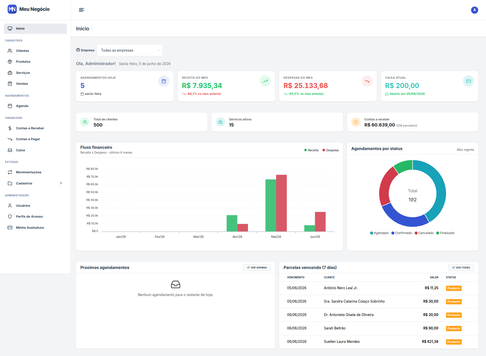
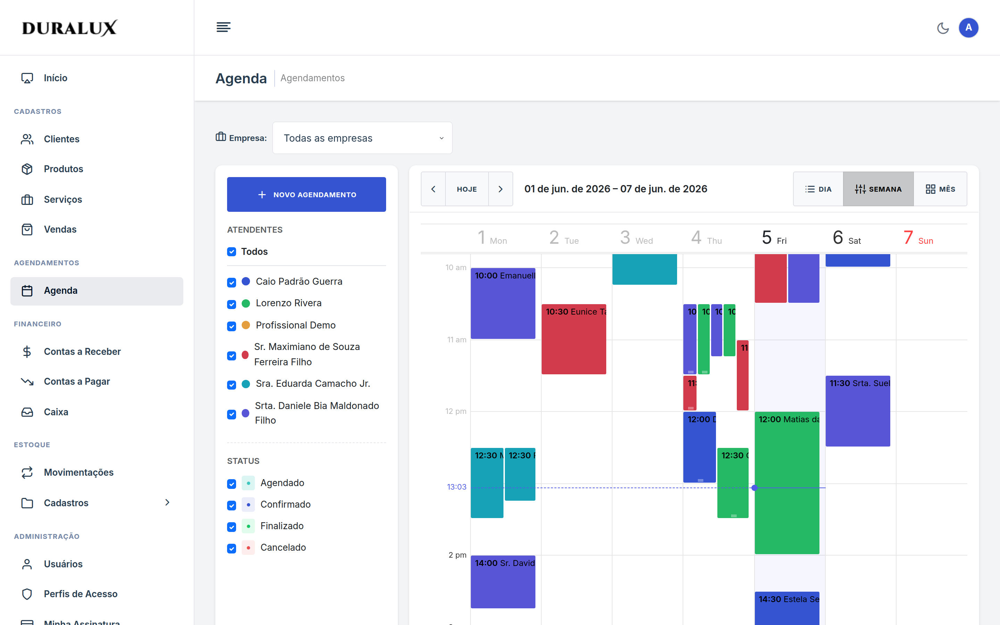
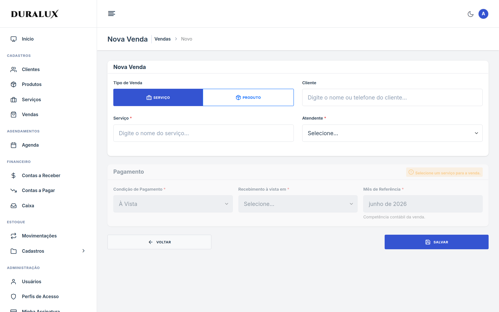
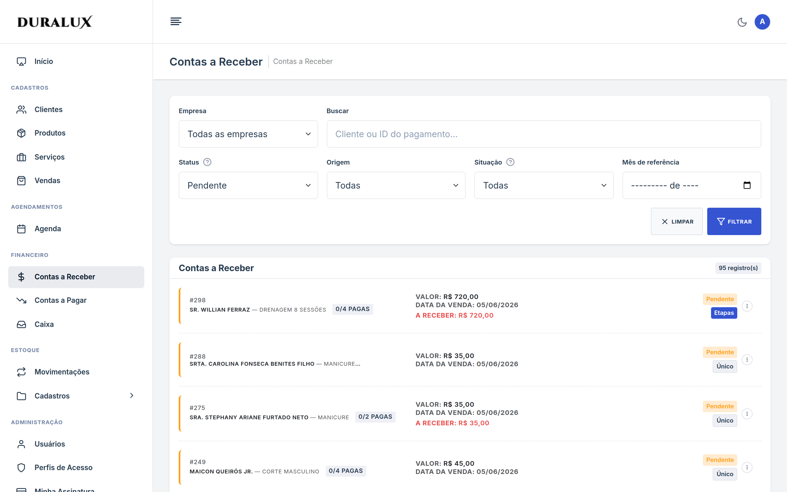
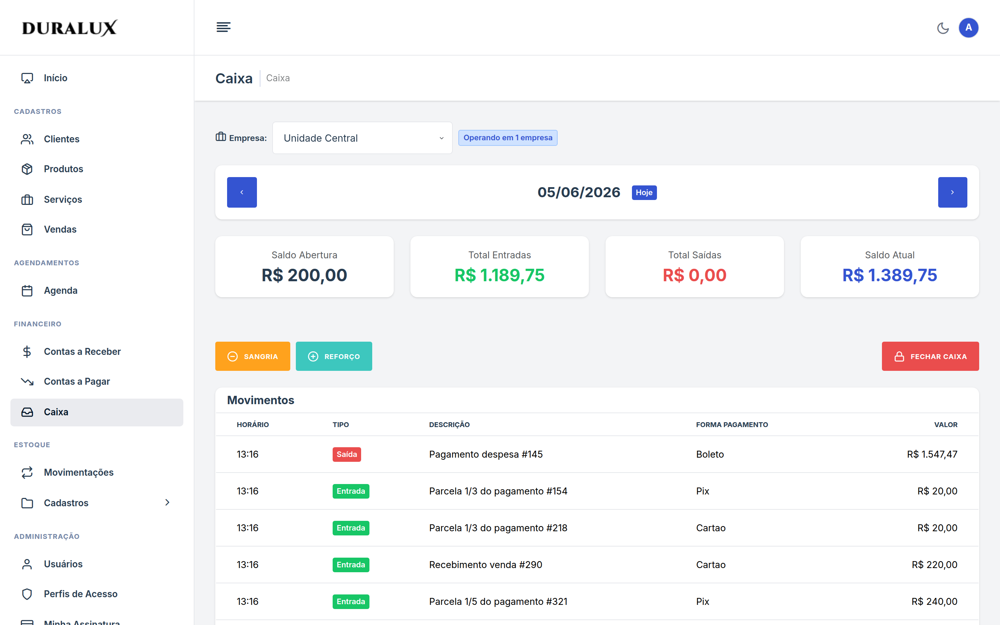

# Meu Negócio

> SaaS multi-tenant para a gestão de pequenos negócios — clínicas, salões, massoterapia e profissionais autônomos. Agenda, vendas, financeiro, caixa diário e estoque em um único produto, isolado por rede e por empresa.

[](https://github.com/Ricardo07g/meu-negocio/actions/workflows/ci.yml)
[](https://www.php.net/)
[](https://laravel.com)
[](https://www.mysql.com/)
[](https://redis.io/)
[](https://docs.docker.com/compose/)
[](LICENSE)

Projeto de **portfólio**: foco em demonstrar arquitetura modular, multi-tenancy single-DB, padrão Título + Parcela + Baixa, Service/Action layer, DTOs unificados (Spatie Laravel Data) e Policies de autorização. A evolução planejada — gateway de pagamento, relatórios, notificações e API — está no [Roadmap](#roadmap).

---

## Sumário

- [Pitch](#pitch)
- [Screenshots](#screenshots)
- [Stack & Arquitetura](#stack--arquitetura)
- [Setup local com Docker](#setup-local-com-docker)
- [Credenciais demo](#credenciais-demo)
- [Estrutura de pastas](#estrutura-de-pastas)
- [Roadmap](#roadmap)
- [Licença](#licença)

---

## Pitch

Donas de pequenos salões, clínicas e profissionais autônomos costumam viver com planilha + WhatsApp + bloco de papel. **Meu Negócio** consolida o operacional do dia-a-dia em uma só ferramenta:

- **Agenda** com bloqueio de conflito de horário e múltiplos atendentes (calendário Toast UI).
- **Vendas** de serviços únicos, serviços em etapas (várias sessões) e produtos físicos, com carrinho multi-item.
- **Financeiro** modelado como Título + Parcela + Baixa: aceita pagamento à vista, à prazo, parcial e renegociação.
- **Caixa diário** com abertura/fechamento, sangria, reforço e estorno automático ao cancelar venda.
- **Estoque** com movimentos de entrada/saída/ajuste vinculados a vendas de produto.
- **Assinatura self-service**: troca de plano com upgrade imediato (pró-rata) e downgrade agendado para o próximo ciclo; faturas mensais e limites por plano — as vagas contam só usuários *ativos* (inativar libera vaga sem perder histórico).
- **Multi-tenant single-DB** com isolamento por `rede_id` e `empresa_id` via Eloquent global scopes.

Stack moderna (PHP 8.3 + Laravel 13), código em português, padrões consistentes módulo a módulo.

---

## Screenshots

Imagens capturadas após rodar o `DesenvolvimentoSeeder` (rede demo com 500 clientes, 600 agendamentos, 160 vendas e 45 dias de caixa retroativo).

### Dashboard
Cards de agendamentos do dia, clientes, receita e contas a receber, com fluxo financeiro (6 meses) e agendamentos por status.



### Agenda
Calendário semanal (Toast UI) com cores por atendente e múltiplas empresas.



### Nova venda
Fluxo de venda — serviço único, serviço em etapas ou produto — com busca AJAX de cliente/serviço/produto e condição de pagamento (à vista / à prazo).



### Contas a Receber
Parcelas pendentes com filtros por empresa/status/competência, badges de situação, baixa parcial e renegociação.



### Caixa diário
Saldo de abertura, entradas/saídas, sangria, reforço e fechamento — com navegação por dia e abertura retroativa.



> Para recapturar localmente: suba o ambiente, rode o `DesenvolvimentoSeeder` e siga [`docs/screenshots/README.md`](docs/screenshots/README.md).

---

## Stack & Arquitetura

### Backend
- **PHP** ^8.3
- **Laravel** ^13.0
- **MySQL** 8.0 + **Redis** (cache/session/queue)
- **Spatie Laravel Permission** ^7.2 (RBAC)
- **Spatie Laravel Data** ^4.20 (DTOs imutáveis)
- **Spatie Laravel Activitylog** ^4.12 (auditoria)
- **barryvdh/laravel-dompdf** (recibos PDF)

### Frontend
- **Vite** ^8.0 + **Tailwind CSS** ^4.0
- **@toast-ui/calendar** ^2.1.3 (agenda)
- **Bootstrap 5** (template Duralux Admin)
- **SweetAlert2** (modais de confirmação)

### Infra de dev
- **Docker Compose** (app PHP-FPM + Nginx 8080 + MySQL 3306 + Redis 6379)

### Padrões aplicados

- **Estrutura modular**: cada domínio em `app/Modules/{Modulo}/` com Controllers / Services / Actions / DTOs / Requests / Policies / Models / Views / Migrations.
- **Multi-tenant single-DB**: traits `RedeTrait` (rede) e `EmpresaTrait` (empresa, com bypass para Admin). Aplicadas via `BaseModel` para consistência.
- **Controllers thin**: pegam request e devolvem response. Toda a regra fica em Service ou Action.
- **Requests unificados**: `SalvarXxxRequest` com `isMethod('post')` para diferenciar criação e atualização.
- **DTOs unificados**: um `XxxData` (Spatie Data) usado tanto para criar quanto para atualizar.
- **Views com partial**: `_form.blade.php` recebe `$entidade` e é incluído por `create.blade.php` e `edit.blade.php`.
- **Modelo financeiro**: Título (`Pagamento` / `Despesa`) + Parcela + Baixa. `condicao_pagamento` (à vista / à prazo) decide o fluxo, `forma_pagamento` fica na parcela/baixa, não no título.
- **Permissões dinâmicas**: catálogo de permissions fixo no código (`recurso.acao`), Roles criados pelo Admin via UI (`/perfis-acesso`). Apenas o Admin master é seedado.

### Desenvolvimento assistido por IA (medido)

O repositório é também uma vitrine de **como desenvolver com IA mantendo qualidade**. A automação vive em [`.claude/`](.claude/), auto-descoberta pelo Claude Code:

- **Conhecimento lazy** — a [`CLAUDE.md`](CLAUDE.md) é um índice enxuto; o domínio detalhado fica em [`.claude/rules/`](.claude/rules/) como *path-scoped rules* que só entram em contexto ao editar arquivos do escopo (a regra do Pagamento carrega ao mexer em `app/Modules/Pagamento/`). Substituiu a antiga pasta `.ai/`, que o assistente nunca lia.
- **Skills** ([`.claude/skills/`](.claude/skills/)) para procedimentos repetíveis (validar uma feature, revisar código, depurar, criar migration…), além de **subagents**, **hooks** (Pint/guards) e **slash commands**.
- **Fonte única** — o plugin distribuível em `devkit/` é **gerado** de `.claude/` por `bin/sync-devkit.sh`, e o CI **barra drift** entre os dois.
- **Qualidade medida** — as 3 skills-flagship passaram por um harness de avaliação A/B (com vs sem a skill, 6 cenários reais sobre este código): **100% vs 90%** de acerto, **~24% mais rápido** e **~20% menos tokens**. O baseline já forte (90%) confirma que as *rules* carregam o conhecimento; a skill agrega consistência e foco.

Detalhes, metodologia e o comparativo em [`docs/AUTOMACAO.md`](docs/AUTOMACAO.md).

### Decisões arquiteturais (ADRs)

As decisões marcantes da arquitetura estão registradas em [`docs/ADR/`](docs/ADR/README.md) no formato MADR-light. Tópicos cobertos: multi-tenant single-DB, modelo financeiro Título+Parcela+Baixa, estrutura modular, BaseModel+traits para tenancy, caixa diário retroativo, padrões de foreign keys e assinatura/troca de plano (upgrade imediato × downgrade agendado pró-rata).

---

## Setup local com Docker

Pré-requisitos: Docker e Docker Compose v2.

```bash
# 1. Clonar
git clone https://github.com/<seu-usuario>/meu-negocio.git
cd meu-negocio

# 2. Copiar .env exemplo
cp .env.example .env

# 3. Subir os containers (app, nginx:8080, mysql:3306, redis:6379)
docker compose up -d

# 4. Instalar dependências PHP e gerar APP_KEY
docker compose exec app composer install
docker compose exec app php artisan key:generate

# 5. Rodar migrations + seeders base (planos + permissões + Admin)
docker compose exec app php artisan migrate:fresh --seed

# 6. (Opcional) Popular com dados volumosos para demonstração
docker compose exec app php artisan db:seed --class=DesenvolvimentoSeeder

# 7. Build dos assets
docker compose exec app npm install
docker compose exec app npm run build
```

Acesse [http://localhost:8080](http://localhost:8080).

### Dia-a-dia

```bash
# Ver logs
docker compose logs -f app

# Shell no container PHP
docker compose exec app bash

# Rodar testes
docker compose exec app composer test

# Lint (PSR-12 via Laravel Pint)
docker compose exec app vendor/bin/pint --test
```

---

## Credenciais demo

Após o `DesenvolvimentoSeeder`:

| Email | Senha | Papel |
|-------|-------|-------|
| `admin@teste.com` | `password` | Admin (acesso total) |
| `atendente1@teste.com` ... `atendente5@teste.com` | `password` | Admin com `atende = true` (aparece no select da agenda) |

> Para fluxo de **reset de senha**: tela de login → "Esqueci minha senha" → digite o email → o email vai para `storage/logs/laravel.log` (driver `log`, sem necessidade de SMTP real).

---

## Estrutura de pastas

```
meu-negocio/
├── .claude/                # Automação de dev com IA: rules (lazy), skills, agents, hooks
├── bin/sync-devkit.sh      # Gera o devkit/ a partir de .claude/ (CI valida a sincronia)
├── app/
│   ├── Modules/{Modulo}/   # 14 módulos (Tenant, Auth, Usuario, Cliente, Servico, Agenda,
│   │                       # Venda, Pagamento, Despesa, Caixa, Estoque, Produto, PerfilAcesso,
│   │                       # Dashboard); cada um com Controllers, Services, Actions, DTOs,
│   │                       # Requests, Policies, Models, Views ({modulo}::nome) e Migrations
│   ├── Enums/              # Status do domínio
│   ├── Http/Middleware/    # verificar.rede, verificar.empresa, verificar.plano
│   ├── Models/BaseModel    # Eloquent base com RedeTrait
│   ├── Support/            # CalculadoraParcelas e helpers do domínio
│   └── Traits/             # RedeTrait, EmpresaTrait, RegistraAtividade, TratamentoErros
├── database/seeders/       # PlanoSeeder, PermissaoSeeder (+ Admin master), DesenvolvimentoSeeder (demo)
├── docker/, docker-compose.yml
├── docs/                   # ADR/, AUTOMACAO.md, FECHAMENTO_PORTFOLIO.md, screenshots/
├── resources/              # views/layouts/ (Duralux), js/calendar.js (Toast UI)
└── routes/web.php
```

---

## Roadmap

Próximas evoluções planejadas, em ordem de prioridade. A base modular (Service/Action, DTOs, Policies, multi-tenancy) foi pensada para absorver cada uma sem reescrita.

| # | Evolução | O que entrega |
|---|----------|---------------|
| 1 | **Notificações & lembretes de agendamento** | Lembrete por e-mail/WhatsApp via fila — reduz no-show, com confirmação/cancelamento pelo cliente. |
| 2 | **Relatórios & exportações** | Faturamento, contas, ranking de serviços e comissões; exportação em CSV/PDF. |
| 3 | **Gateway de pagamento** (Stripe / Mercado Pago / Asaas) | Cobrança online e PIX, com conciliação automática das baixas. |
| 4 | **API REST + tokens (Sanctum)** | Superfície para integrações e um futuro app mobile. |
| 5 | **2FA + verificação de e-mail no registro** | Hardening de conta (o fluxo de reset de senha já existe). |
| 6 | **Observabilidade** (Sentry + métricas) | Rastreio de erros e saúde da aplicação em produção. |
| 7 | **Tempo real** (WebSockets) | Agenda colaborativa e atualização ao vivo entre atendentes. |
| 8 | **Internacionalização (i18n)** | Hoje PT-BR by design; abrir o caminho para outros idiomas. |

> **Para colocar em produção** (auto-hospedagem): APP_KEY real, fila de jobs com supervisor, `MAIL_MAILER` SMTP, backup do MySQL, HTTPS na borda (Caddy/Traefik) e log centralizado.

---

## Licença

Este projeto está sob a licença MIT — ver [`LICENSE`](LICENSE). O MIT cobre **o código da aplicação**; os assets em `public/assets/**` (template Duralux Admin + bibliotecas de terceiros) seguem suas próprias licenças — ver [`NOTICE.md`](NOTICE.md).

---

Built with [Laravel](https://laravel.com), [Tailwind CSS](https://tailwindcss.com), [Toast UI Calendar](https://github.com/nhn/tui.calendar), e a stack Spatie. Template visual: [Duralux Admin](https://duralux.minible.com/) (Bootstrap 5).
